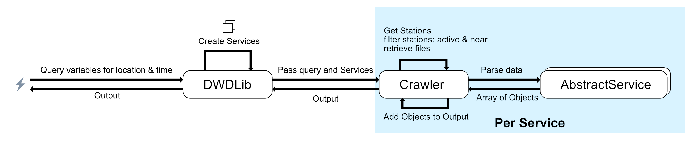

# DWD-Crawler

This package contains methods to query the DWD FTP by specifying the parameters you want to query, as well as a date and latitude + longitude.

## Data Source
All data is retrieved from the public data set made available by the German Meteorological Service (DWD). 

Root of the public CDC FTP: `ftp://ftp-cdc.dwd.de/pub/CDC/`.


## Explanation
The current implementaton revieces a request with the needed variables, the user's location at a specific point in time. Afterwards the DWDLib objects initializes the requested variable's services that contain all the paths and the method to parse the data into a corresponding class that extends `DWDAbstractParameter`. Afterwards the Crawler combines the data for all requested variables and returns them as an array to the callee. 

## Features

- Queries recent hourly data on the public DWD FTP for all of Germany
    - [Available params](ftp://ftp-cdc.dwd.de/pub/CDC/observations_germany/climate/hourly/)
- Contains a safe query option that queries several nearest stations to get one result
- Parses the Output into different Objects that contain all of the data the file contains plus the short description for 
all the parameters.

## Fixed
- Change the config from using OS dependant slashes on Ftp paths - currently the script fails on win due to backslashes in the FTP Path.
    - Only local file use the OS dependant slashes.
- Allow the user to modify the baseDirectory of the output via the constructor flag.
    - Can be done by specifying a param when creating the DWDLib instance.
- Allow the user to split queried variables from the predefined groups by the dwd to single variables.
- Add distance from station to the queried point
- Added Fractal support


## Todo
- Cache nearest station for one crawler task (can't be done as of now, as each variable may have other active controllers.)
- Change code: check if query date is older or equal than last checked, else do not query
- If older data is queried maybe disable the check if a station is active this is extremely important for Solar stuff
    - maybe rewrite the "active" part in a way that checks if the queried date is inside the "active" period of stations
- Add option to enable logging via the constructor
- Add option to set the radius of active stations near the given point.

## Example
Usage of the library is quite simple:
```php
//Coordinates we want to query
$coordinates=new Coordinate(48.3751,8.9801);
//Use default folders
$dwdLib=new DWDLib();

//OR: set output of the downloaded files to <dir>/storage/...
$dwdLib = new DWDLib("storage");

//set up which parameters you need
$param = new DWDHourlyParameters();
$param->addAirTemperature()->addCloudiness()->addPrecipitation()->addPressure()->addSoilTemperature()->addSun()->addWind()/*->add...*/;
// EITHER:
$out = $dwdLib->getHourlyByInterval($param, $date, $coordinates->getLat(), $coordinates->getLng());
// OR: to get all data for one day
$out = $dwdLib->getHourlyDataByDay($vars, $date, $coordinates->getLat(), $coordinates->getLng());

```
out consists of an array with the key ` values` => weather params and `stations` => weather stations.
### DWD Parameter "Groups"
Get Parameter JSON:
```php
/*
 * Print all retrieved items in the 'values' part => weather parameters as json
 */
foreach ($out['values'] as $key => $obj) {
    print "obj=$key<br>";
    //either iterate to convert single items
    foreach ($obj as $value) {
        /* @var $value DWDAbstractParameter */
        //Each model has a toResource method that returns Fractal's ResourceAbstract, it can be used to retrieve an array or json data
        prettyPrint(FractalWrapper::toJson(FractalWrapper::toResource($parameter,new ParameterTransformer()),JSON_PRETTY_PRINT));
    //or use fractal wrapper if you want to convert everything
    $collection=FractalWrapper::toResource($obj,new ParameterTransformer());
    prettyPrint(FractalWrapper::toJson($collection,JSON_PRETTY_PRINT));
    }
}
```
Output:
```json
{
    "data": {
        "station_id": 2074,
        "description": {
            "qualityLevel": "QN_9: quality level - refer to ftp:\/\/ftp-cdc.dwd.de\/pub\/CDC\/observations_germany\/climate\/hourly\/air_temperature\/recent\/DESCRIPTION_obsgermany_climate_hourly_tu_recent_en.pdf",
            "temperature2m": "TT_TU: temperature in 2m height - in degrees Celsius.",
            "relativeHumidity": "RF_TU: relative humidity in percent.",
            "temperature2mUnit": "C",
            "relativeHumidityUnit": "%"
        },
        "classification": "Temperature",
        "distance": 8.651701,
        "lon": "8.9801",
        "lat": "48.3751",
        "date": "2017-09-16T22:00:00+00:00",
        "2m_temperature": "6.5",
        "2m_temperature_unit": "C",
        "relative_humidity": "96.0",
        "relative_humidity_unit": "%"
    }
}
```
### Stations
Get Station JSON:
```php
/*
 * Print all stations as json
 */
foreach ($out['stations'] as $key => $obj) {
    print "obj=$key<br>";
    /* @var $obj \FWidm\DWDHourlyCrawler\Model\DWDStation */
    prettyPrint(FractalWrapper::toJson(FractalWrapper::toResource($obj,new StationTransformer()),JSON_PRETTY_PRINT));
    
}
//or use fractal wrapper if you want to convert everything
$collection=FractalWrapper::toResource($out['stations'] ,new StationTransformer());
prettyPrint(FractalWrapper::toJson($collection,JSON_PRETTY_PRINT));
```
Output:
```json
{
    "data": {
        "id": "02074",
        "from": "2004-06-01T09:27:45+00:00",
        "until": "2017-11-28T09:27:45+00:00",
        "name": "Hechingen",
        "state": "Baden-W\u00fcrttemberg",
        "height": "522",
        "lon": "8.9801",
        "lat": "48.3751",
        "active": true
    }
}

```

### Compact Parameters
In addition, it is possible to transform these "grouped" parameters into single variable objects:

```php
$collection=FractalWrapper::toResource($exported,new CompactParameterTransformer());
prettyPrint(FractalWrapper::toJson($collection,JSON_PRETTY_PRINT));
```

Output:
```json

{
    "data": [
        {
            "station_id": 2074,
            "description": {
                "name": "TT_TU: temperature in 2m height - in degrees Celsius.",
                "quality": 3,
                "qualityType": "QN_9: quality level - refer to ftp:\/\/ftp-cdc.dwd.de\/pub\/CDC\/observations_germany\/climate\/hourly\/air_temperature\/recent\/DESCRIPTION_obsgermany_climate_hourly_tu_recent_en.pdf",
                "units": "C"
            },
            "classification": "Temperature",
            "distance": 8.651701,
            "lon": "8.9801",
            "lat": "48.3751",
            "date": "2017-09-16T22:00:00+02:00",
            "value": 6.5,
            "type": "2 metre temperature"
        },
        {
            "station_id": 2074,
            "description": {
                "name": "RF_TU: relative humidity in percent.",
                "quality": 3,
                "qualityType": "QN_9: quality level - refer to ftp:\/\/ftp-cdc.dwd.de\/pub\/CDC\/observations_germany\/climate\/hourly\/air_temperature\/recent\/DESCRIPTION_obsgermany_climate_hourly_tu_recent_en.pdf",
                "units": "%"
            },
            "classification": "Temperature",
            "distance": 8.651701,
            "lon": "8.9801",
            "lat": "48.3751",
            "date": "2017-09-16T22:00:00+02:00",
            "value": 96,
            "type": "relative humidity in percent"
        }
    ]
}
```